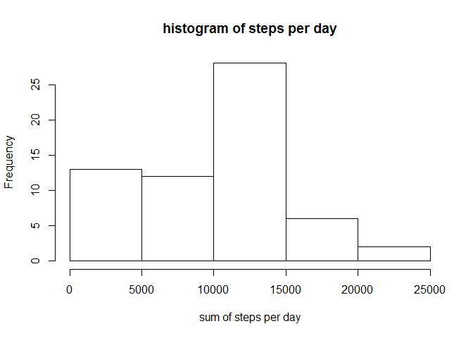

Set the working directory and load and preprocess the data

      echo = TRUE
      setwd("C:/Users/Sandra/Documents/Coursera/Reproductible Research/Week2 Assignment") 
      activity <- NULL
      activity <- read.csv("activity.csv", header = T, sep = ",")

Initialize the variables

      echo = TRUE
      df_summary <- NULL
      su2 <- NULL
      su <- NULL
      mn_int <- NULL
      activity2 <- NULL
      mean_su2 <- NULL
      median_su2 <- NULL
      activity2_weekend <- NULL
      activity2_weekday <- NULL
      mean_activity2_weekday <- NULL
      mean_activity2_weekend <- NULL

Mean total number of steps taken per day?

      echo = TRUE
      su <- tapply(activity$steps, activity$date, sum, na.rm=T)

Histogram of the total number of steps taken each day.

      hist(su, xlab = "sum of steps per day", main = "histogram of steps per day")

The mean and the median total number of steps taken per day are reported
:

      echo = TRUE
      mean_su <- round(mean(su))
      median_su <- round(median(su))

      print(c("The mean is",mean_su))

    ## [1] "The mean is" "9354"

      print(c("The median is",median_su))

    ## [1] "The median is" "10395"

The average daily activity pattern

Time series plot for a 5 minute interval and the average number of steps
taken, averaged across all days

      echo = TRUE
      mn_int <- tapply(activity$steps, activity$interval, mean, na.rm=T)
      plot(mn_int ~ unique(activity$interval), type="l", xlab = "5-min interval")

Which 5-minute interval, on average across all the days in the dataset,
contains the maximum number of steps?

      echo = TRUE
      mn_int[which.max(mn_int)]

    ##      835 
    ## 206.1698

Imputing missing values

      echo = TRUE
      table(is.na(activity) == TRUE)

    ## 
    ## FALSE  TRUE 
    ## 50400  2304

      summary(activity)

    ##      steps                date          interval     
    ##  Min.   :  0.00   2012-10-01:  288   Min.   :   0.0  
    ##  1st Qu.:  0.00   2012-10-02:  288   1st Qu.: 588.8  
    ##  Median :  0.00   2012-10-03:  288   Median :1177.5  
    ##  Mean   : 37.38   2012-10-04:  288   Mean   :1177.5  
    ##  3rd Qu.: 12.00   2012-10-05:  288   3rd Qu.:1766.2  
    ##  Max.   :806.00   2012-10-06:  288   Max.   :2355.0  
    ##  NA's   :2304     (Other)   :15840

Devise a strategy for filling in all of the missing values in the
dataset

      echo = TRUE
      activity2 <- activity  # creation of the dataset that will have no more NAs
      for (i in 1:nrow(activity)){
       if(is.na(activity$steps[i])){
         activity2$steps[i]<- mn_int[[as.character(activity[i, "interval"])]]
        }
      }

Histogram of the total number of steps taken each day and Calculate and
report the mean and median total number of steps taken per day

      echo = TRUE
      su2 <- tapply(activity2$steps, activity2$date, sum, na.rm=T)
      hist(su2, xlab = "sum of steps per day", main = "histogram of steps per day")

      mean_su2 <- round(mean(su2))
      median_su2 <- round(median(su2))

      echo = TRUE
      print(c("The mean is",mean_su2))

    ## [1] "The mean is" "10766"

      print(c("The median is",median_su2))

    ## [1] "The median is" "10766"

Compare the new values with the "old" values:

      echo = TRUE
      df_summary <- rbind(df_summary, data.frame(mean = c(mean_su, mean_su2), median = c(median_su, median_su2)))
      rownames(df_summary) <- c("with NA's", "without NA's")
      print(df_summary)

    ##               mean median
    ## with NA's     9354  10395
    ## without NA's 10766  10766

      echo = TRUE
      summary(activity2)

    ##      steps                date          interval     
    ##  Min.   :  0.00   2012-10-01:  288   Min.   :   0.0  
    ##  1st Qu.:  0.00   2012-10-02:  288   1st Qu.: 588.8  
    ##  Median :  0.00   2012-10-03:  288   Median :1177.5  
    ##  Mean   : 37.38   2012-10-04:  288   Mean   :1177.5  
    ##  3rd Qu.: 27.00   2012-10-05:  288   3rd Qu.:1766.2  
    ##  Max.   :806.00   2012-10-06:  288   Max.   :2355.0  
    ##                   (Other)   :15840

Differences in activity patterns between weekdays and weekends?

Column is added to the dataframe, this column will contain the factor
"weekday days"" or "weekend days".

      echo = TRUE
      activity2$weekday <- c("weekday")
      activity2[weekdays(as.Date(activity2[, 2])) %in% c("Saturday", "Sunday", "samedi", "dimanche", "saturday", "sunday", "Samedi", "Dimanche"), ][4] <- c("weekend")
      table(activity2$weekday == "weekend")

    ## 
    ## FALSE  TRUE 
    ## 12960  4608

      activity2$weekday <- factor(activity2$weekday)

Visualize the difference bewteen weekends and days of the week, a new
dataframe is created to be usable by the lattice package. First, the
data are calculated

      echo = TRUE
      activity2_weekend <- subset(activity2, activity2$weekday == "weekend")
      activity2_weekday <- subset(activity2, activity2$weekday == "weekday")

      mean_activity2_weekday <- tapply(activity2_weekday$steps, activity2_weekday$interval, mean)
      mean_activity2_weekend <- tapply(activity2_weekend$steps, activity2_weekend$interval, mean)

Dataframe is prepared and the plot is produced

      echo = TRUE
      library(lattice)
      df_weekday <- NULL
      df_weekend <- NULL
      df_final <- NULL
      df_weekday <- data.frame(interval = unique(activity2_weekday$interval), avg = as.numeric(mean_activity2_weekday), day = rep("weekday", length(mean_activity2_weekday)))
      df_weekend <- data.frame(interval = unique(activity2_weekend$interval), avg = as.numeric(mean_activity2_weekend), day = rep("weekend", length(mean_activity2_weekend)))
      df_final <- rbind(df_weekday, df_weekend)

      xyplot(avg ~ interval | day, data = df_final, layout = c(1, 2), 
             type = "l", ylab = "Number of steps")

